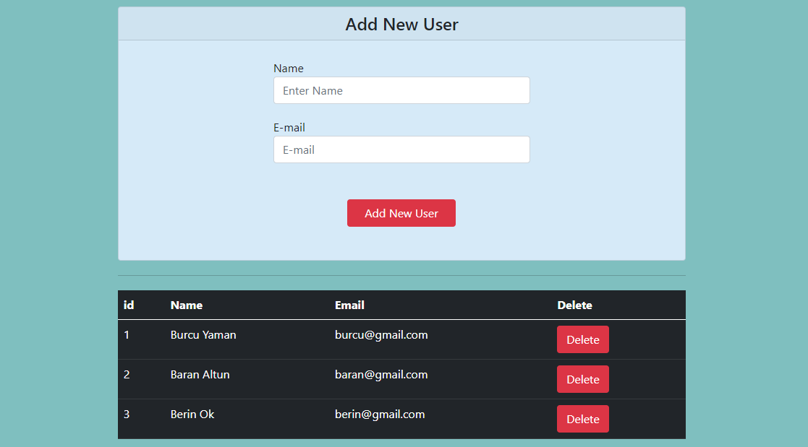

# User App with React

-This project is my first react project.
-There is a table where the user information is kept. 
-We have a form with 2 inputs.
-When we enter the username and email in this form and click the add button, the user is added to the table.
-User id is given randomly.
-When we want to delete the user, we can delete it by pressing the delete button in the table.

